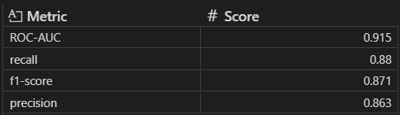

# Heart Disease Risk Prediction using Machine Learning

## Project Overview

This project explores the prediction of heart disease using clinical and physiological patient data through a complete machine learning workflow. The analysis includes data cleaning, exploratory data analysis (EDA), feature engineering, model evaluation, threshold optimization, and model interpretability.

The main objective was to develop a predictive model capable of identifying patients at risk of heart disease while balancing predictive performance and clinical interpretability.

## Dataset

* Source: [Heart Failure Prediction Dataset - Kaggle](https://www.kaggle.com/datasets/fedesoriano/heart-failure-prediction?utm_source=chatgpt.com)
* Observations: 918 patients
* Features: Clinical and physiological variables related to cardiovascular health

### Main Variables

* Age
* Sex
* ChestPainType
* RestingBP
* Cholesterol
* MaxHR
* ExerciseAngina
* Oldpeak
* ST_Slope
* HeartDisease (Target)

## Workflow

### Data Understanding

### Data Cleaning

* Removed physiologically inconsistent values:

  * `RestingBP = 0`
  * `Oldpeak < 0`
* Treated `Cholesterol = 0` as missing data
* Median imputation for Cholesterol

### Exploratory Data Analysis (EDA)

#### Univariate Analysis

Distribution analysis of:

* Cholesterol
* Oldpeak
* RestingBP
* Age
* MaxHR
* Heart Disease

Techniques used:

* Histograms
* Density plots
* Boxplots
* Q-Q plots
* Normality tests
  * Shapiro-Wilk
  * D’Agostino-Pearson

#### Bivariate Analysis

Relationship between features and heart disease:

* Numerical variables vs target
* Categorical variables vs target

Main findings:

* Higher *Oldpeak* and Lower *MaxHR* values were strongly associated with heart disease.
* Exercise-induced angina, type of chest pain, slope segment ST of max exercise and fasting blood sugar showed a strong association with cardiovascular risk

### Feature Engineering & Preprocessing

* Categorical variables were transformed using One-hot encoding for nominal categorical variables.
*  `drop_first=True` was applied to avoid multicollinearity by using reference categories.

### Correlation Analysis

A correlation matrix was used to explore relationships between numerical variables and identify potential multicollinearity patterns.

Key findings:

- *Oldpeak* showed a positive association with heart disease.
- *MaxHR* showed a negative association with cardiovascular risk.
- No severe multicollinearity issues were detected among numerical predictors.

### Machine Learning Models

The following classification models were evaluated:

* Logistic Regression
* Decision Tree
* Random Forest
* XGBoost

Evaluation metrics:

* ROC-AUC
* Recall
* Precision
* F1-score

### Model Evaluation

#### Best Model

Logistic Regression achieved the best balance between:

* Predictive performance
* Recall
* Interpretability

#### Final Metrics

### Threshold Optimization

Threshold tuning was performed to reduce false negatives and improve sensitivity to heart disease cases.

#### Clinical motivation

In medical screening problems, false negatives can be critical because patients with heart disease may remain undetected.

By lowering the classification threshold:

* False negatives were reduced
* Recall improved
* Sensitivity increased

This trade-off was considered clinically acceptable despite a moderate increase in false positives.

### Model Interpretability

Logistic Regression coefficients and Odds Ratios were analyzed to identify the most influential predictors.

#### Main Positive Predictors

* Exercise-induced angina
* ST depression (*Oldpeak*)
* Flat ST slope

#### Protective Associations

* Higher maximum heart rate (*MaxHR*)
* Upsloping ST segment
* Chest Pain Type Atypical Angina

The learned relationships were consistent with known cardiovascular risk factors.

## Key Insights

* Logistic Regression outperformed more complex models while remaining interpretable.
* Threshold optimization significantly improved clinical sensitivity.
* Some variables with weak individual discrimination still contributed valuable information in multivariate modeling.
* Clinically meaningful patterns were successfully identified through machine learning.

## Tools & Libraries

* Python
* Pandas
* NumPy
* Matplotlib
* Seaborn
* Scikit-learn
* XGBoost

## Repository Structure

heart-disease-risk-analysis/
│
├── data/
├── images/
├── notebook/
├── README.md
├── requirements.txt
└── .gitignore

## Future Work

- Evaluate additional calibration techniques and threshold optimization strategies.
- Investigate feature interactions and non-linear relationships in greater depth.
- Validate the model using external datasets.

## Author

### **Tomás Barría**

Biotechnology Engineer transitioning into Data Science and Analytics with interests in:

* Healthcare Analytics
* Machine Learning
* Predictive Modeling
* Data Visualization
